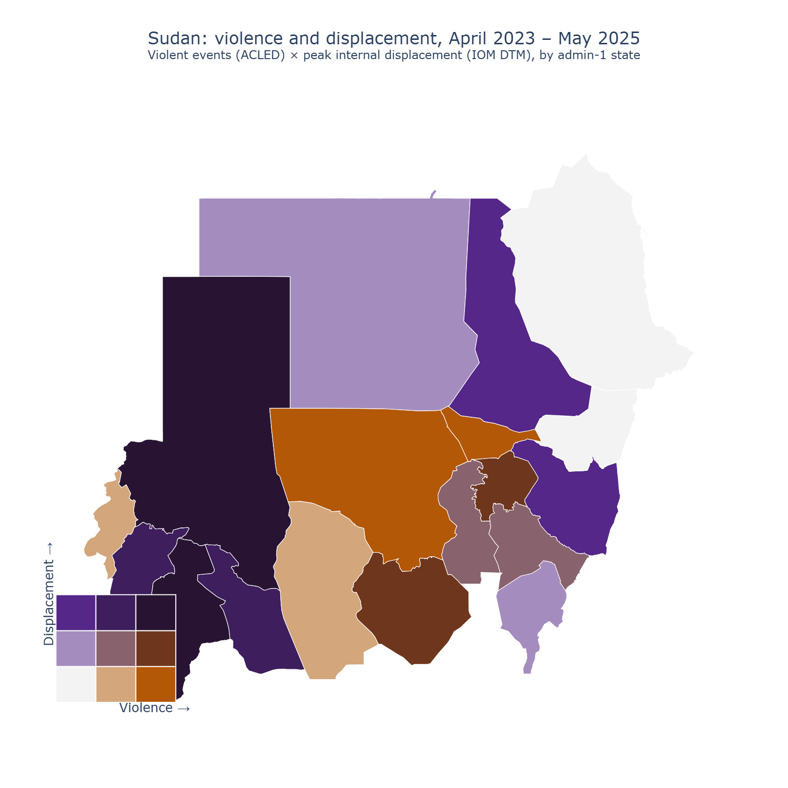

# Sudan war displacement mapping

> Two years into the Sudan war, how have violence and displacement co-evolved across the country and its neighbors?



## The question

The war that broke out in Sudan in April 2023 has produced one of the largest displacement crises of the decade — millions internally displaced, and millions more crossing into Chad, South Sudan, Egypt, Ethiopia, and the Central African Republic. This project maps how *violence intensity* and *displacement flows* have co-evolved geographically and over time. We are **not** attempting to causally attribute displacement to specific events or actors — the data does not support that — and we are **not** producing a humanitarian needs assessment, which has its own established methodology. The deliverable is a geographic and temporal description of the conflict's footprint that could serve as input to either of those richer studies.

## Data

| Source | Granularity | Time coverage | Access |
|--------|-------------|---------------|--------|
| [ACLED conflict events](https://acleddata.com/) | Event-level (lat/lon, date, event type, actors) | April 2023 – May 2025 | Registered account; OAuth2 API is **tier-gated** — snapshot built from a manual Data Export Tool download |
| [UNHCR Sudan situation portal](https://data.unhcr.org/en/situations/sudansituation) | Country-of-asylum aggregates | April 2023 onward | Public (Refugee Statistics API + situation-portal snapshot) |
| [IOM DTM Sudan](https://dtm.iom.int/sudan) | Admin-1 internal-displacement counts | August 2023 onward | Free API subscription key (DTM v3 API) |
| [GADM 4.1 administrative boundaries](https://gadm.org/) | Admin-1 polygons for Sudan + 5 neighbors | Current | Public download |

**Access date: 2026-05-19.** ACLED revises historical records as new sourcing emerges, so the access date is pinned and a parquet snapshot (`data/processed/acled_snapshot_2026-05-19.parquet`) is the canonical analytic input — the notebook reads the snapshot, never the live API. The ACLED account tier withholds the most recent ~12 months of events, so the analysis window ends at **2025-05-19**; the IOM DTM internal-displacement series begins **August 2023**. Manual-download provenance (file names, URLs, SHA256 checksums) is documented in `data/raw/README.md`.

## Method

The analysis runs in two co-registered layers. The **violence layer** uses ACLED event records — geocoded to lat/lon and classified by event type — aggregated to admin-1 by time window. The **displacement layer** combines IOM DTM internal-displacement counts (admin-1, Sudan) with UNHCR cross-border-flow counts (origin Sudan, destination = neighbor country) into a single origin-destination dataset. The two layers are joined on a common admin-1 grid for Sudan and its neighbors, producing temporal heatmaps, an origin-destination chord/network diagram, and the hero bivariate choropleth (violence intensity × displacement magnitude). The strongest critique of this approach is that ACLED and IOM/UNHCR are produced by very different processes — ACLED is a media-coded event database with known geographic bias toward areas with media coverage, while IOM DTM relies on field assessments whose frequency varies by access. The correlation we describe is therefore partly a correlation between two data systems' coverage footprints, not purely between violence and displacement. The methodological-decisions table below addresses this directly.

## Methodological decisions

Each major data-processing decision was made by **diagnostic first, choice second**. The table below is an at-a-glance summary; the full five-part rationale (problem / diagnostic / options / decision + rationale / sensitivity) lives inline in `notebooks/02_main.ipynb`.

| # | Decision | Chose | Why (anchored in diagnostic) | Sensitivity |
|---|----------|-------|------------------------------|-------------|
| 1 | ACLED event-type filtering (which `event_type` count as "violence") | **Battles + Explosions/Remote violence + Violence against civilians** (3 kinetic types) | These three carry 99.9% of Sudan's recorded fatalities (44,709 of 44,715); Protests, Riots and Strategic developments together account for 34 deaths. | Re-running under a narrow (2-type) and broad (all-6) filter swings event counts −31% / +31%, but per-state ranking is robust (Spearman ρ = 0.98 / 0.96). |
| 2 | Geocoding precision threshold (drop events above ACLED `geo_precision` X) | **Keep all tiers** | `admin1` is populated for 100% of Sudan events at every precision tier — at admin-1 resolution, dropping imprecise events discards correctly-placed data and biases against remote states. | Dropping `geo_precision ≥ 3` removes only 1.19% of the violence layer; ρ = 1.000, zero rank changes. |
| 3 | Temporal aggregation (weekly vs. monthly bins) | **Monthly** | A signal-to-noise diagnostic on 5 held-out states showed weekly adds no autocorrelation over monthly but leaves 35–83% empty bins in quiet states. | Per-state totals are bin-invariant (ρ = 1.000); weekly leaves 41.7% of the state×time grid empty vs. 16.0% monthly. Both heatmaps rendered in `03_robustness.ipynb`. |
| 4 | Bivariate classification thresholds (3×3 quantile vs. fixed cutoffs) | **3×3 quantile bins** | Violence is skewed 3.57× by Khartoum, so equal-width fixed cutoffs collapse 17/18 states into the bottom violence third and fill only 4 of 9 bivariate classes; quantile bins fill all 9. | The headline independence finding (ρ = −0.055) is computed on raw ranks — invariant to re-binning. Both maps rendered in `03_robustness.ipynb`. |
| 5 | Reconciling IOM DTM vs. UNHCR where both report a flow | **Kept as two complementary layers, never summed**; within UNHCR, the situation-portal snapshot is the primary cross-border source | The diagnostic showed DTM (internal IDPs) and UNHCR (cross-border refugees) measure *disjoint* flows — zero shared origin-destination pairs. The genuine disagreement is *within* UNHCR: the Statistics API reports ~31k registered refugees in Egypt vs. ~1.5M arrivals in the portal snapshot (registration vs. government estimate). | Not a tunable threshold — the registration/estimate gap is itself reported as a finding rather than silently averaged away. |
| 6 | Admin-1 boundary reconciliation (GADM vs. ACLED strings vs. IOM/UNHCR codes) | **GADM polygons keyed by OCHA pcode `SD01`–`SD18`**, matched via name normalisation + hand overrides | Sudan reconciles 18/18 states. Abyei — ACLED's 19th Sudan unit — has no GADM 4.1 polygon, so its events are folded into the adjoining South Kordofan. | The Abyei merge moves 181 events (1.09% of the violence layer); checked in `03_robustness.ipynb`. |
| 7 | IOM DTM operation selection (the snapshot carries three) | **`Armed Clashes in Sudan (Overview)`** | The three operations track the *same* IDP population at incompatible magnitudes (Dec 2023: 5.9M vs. 9.1M) — stacking them multiply-counts. `(Overview)` is the only series spanning the analytic window. | Cost: the internal-displacement layer begins August 2023, four months after war onset (see Limitations). |

> Brand note: every choice above is an *educated* decision, not a convention. If you'd defend it differently, the diagnostic data is in the notebook — read it and tell me where I'm wrong. The bivariate-map **palette** is a further documented decision (color-blind-safe 3×3 PuOr, perceptually monotonic) — kept out of this table because it is a visualization choice, not a data-processing one; see `notebooks/02_main.ipynb` §7.

## Findings

Each statement is falsifiable and anchored in a number from the analysis (April 2023 – May 2025 window unless noted).

- **Violence and displacement are geographically decoupled.** Across Sudan's 18 states, the rank of cumulative violent-event intensity and the rank of peak internal-displacement stock are statistically independent: Spearman ρ = **−0.055**. The places with the most fighting are largely not the places hosting the most displaced people.
- **Darfur is the one exception.** North and South Darfur are the *only* states that fall in the high-violence **and** high-displacement third of the 3×3 bivariate grid. North Darfur alone records **11,793** fatalities — the most of any state.
- **Khartoum is high-violence, low-IDP-stock.** The capital records the most violent events of any state (**6,080**, 3.6× the next-highest), yet sits in the low third for IDPs *present* — it produced displacement rather than hosting it.
- **River Nile and Gedaref are refuge states.** Both are low-violence, high-displacement — states absorbing IDPs from elsewhere rather than generating them.
- **The displacement crisis is enormous and still growing.** The national internal-displacement stock rose from **7.1M** (Aug 2023) to a peak of **11.6M** (Jan 2025). Separately, UNHCR's portal snapshot records Sudanese refugees across **7** asylum destinations, led by Egypt, Chad and South Sudan.
- **Aggregate filtering is robust.** Across narrow / chosen / broad event-type filters, geo-precision thresholds, and weekly vs. monthly bins, no headline geographic finding moves — per-state rankings hold at ρ ≥ 0.96 (see `03_robustness.ipynb`).

## Limitations

- **Coverage stops at May 2025.** The ACLED account tier withholds the most recent ~12 months of events, so the violence layer ends 2025-05-19; the analysis cannot speak to anything after that date. The final monthly bin (May 2025) is partial — it runs only to the 19th.
- **The displacement layer starts four months late.** The IOM DTM `(Overview)` series begins August 2023, so the internal-displacement picture misses the war's opening months (April–July 2023), which the violence layer *does* cover. Co-registered figures (the dashboard, the bivariate map) handle this offset explicitly.
- **Two data systems, two coverage footprints.** ACLED is media-coded — events in well-covered areas are over-represented relative to remote ones — while IOM DTM relies on field assessments whose frequency varies with access. Any co-movement we describe is partly a correlation between two coverage footprints, not purely between violence and displacement. The decoupling finding (ρ = −0.055) is, if anything, conservative against this bias.
- **Neighbour admin-1 detail is not co-registered.** Egypt's 27 governorates and 4 of Ethiopia's ACLED regions could not be matched to GADM 4.1 polygons (different romanisation; GADM predates Ethiopia's 2020–2023 reorganisation). Neighbours enter the analysis at country level (as refugee destinations) only.
- **UNHCR's two sources disagree by ~50×.** Registered-refugee counts (Statistics API) and arrival estimates (portal snapshot) differ materially — e.g. Egypt ~31k vs. ~1.5M. Charts label which figure they use; the gap is reported, not reconciled.
- **The admin-1 grid masks within-region heterogeneity**, and the analysis is **descriptive** — co-movement is not causation. We do not attribute displacement to specific events or actors.

## Visual style

This project uses **Plotly** because the headline deliverable is an animated Streamlit dashboard with a date slider, an interactive origin-destination chord diagram, and a drill-down bivariate map — all of which depend on hover state, click-through, and animation that Plotly handles natively. Static thumbnail-quality export of the hero bivariate map is generated alongside (via `plotly.io.write_image`) so the GitHub README and social-media share previews still get a clean static image.

## How to reproduce

```bash
git clone <url>
cd 03-sudan-displacement

# Install with the geo + interactive viz extras
pip install -e ".[viz,geo]"

# Run the main notebook — it reads the committed pinned snapshots,
# so no credentials or network access are needed to reproduce the analysis.
jupyter lab notebooks/02_main.ipynb

# Or launch the dashboard
streamlit run app/streamlit_dashboard.py
```

The committed pinned snapshots in `data/processed/` (ACLED, IOM DTM, and the derived analytic layers) make the notebook reproducible top-to-bottom **offline** — `02_main.ipynb` runs in well under a minute. Re-acquiring the raw sources from scratch is a separate, optional step: ACLED needs a registered account (its API is tier-gated — the snapshot here was built from a manual Data Export Tool download), and IOM DTM needs a free API subscription key. Both are documented, with file names and SHA256 checksums, in `data/raw/README.md`; credentials go in a gitignored `secrets.toml`.

## Files

- `notebooks/02_main.ipynb` — the analysis (start here)
- `notebooks/03_robustness.ipynb` — sensitivity checks for event-type filter, geocoding precision threshold, and bivariate cutoffs
- `src/sudan_displacement/data.py` — ACLED + UNHCR + IOM DTM + GADM loaders with caching
- `src/sudan_displacement/viz.py` — heatmap, chord, bivariate-choropleth helpers (Plotly)
- `src/sudan_displacement/diagnostics.py` — diagnostic helpers used in decision blocks
- `data/raw/` — fetched source files (gitignored if large); IOM DTM manual downloads documented here
- `data/processed/` — derived analytic dataset (parquet, committed)
- `figures/` — saved figures, including `hero.png` static export of the bivariate map (committed)
- `app/streamlit_dashboard.py` — animated dashboard with date slider (primary interactive deliverable)
- `tests/test_smoke.py` — minimal smoke tests

## Author

Muhanad — [LinkedIn](URL) · [Twitter](URL)
